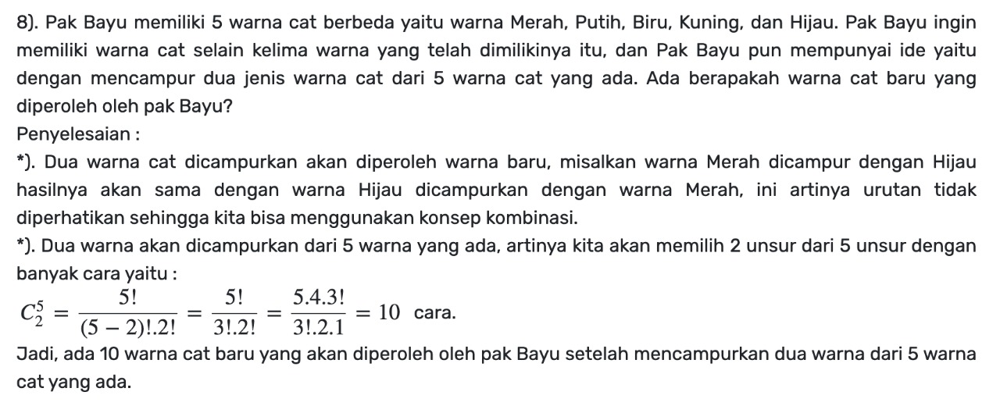
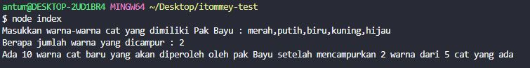

# ITOMMEY TEST

## Soal

## Cara menjalankan program

- Jalankan perintah `node index.js` atau `node index`
- Masukkan warna-warna cat yang dimiliki Pak Bayu dengan koma (tanpa spasi) sebagai pemisah masing-masing warna
- Masukkan berapa jumlah warna yang dicampur
- Akan muncul output berapa total warna yang dihasilkan setelah mencampur warna

## Contoh output

